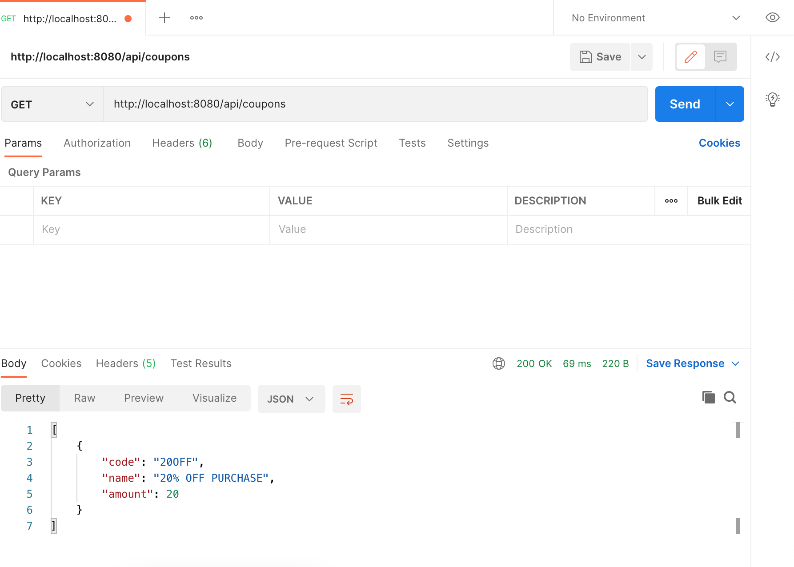
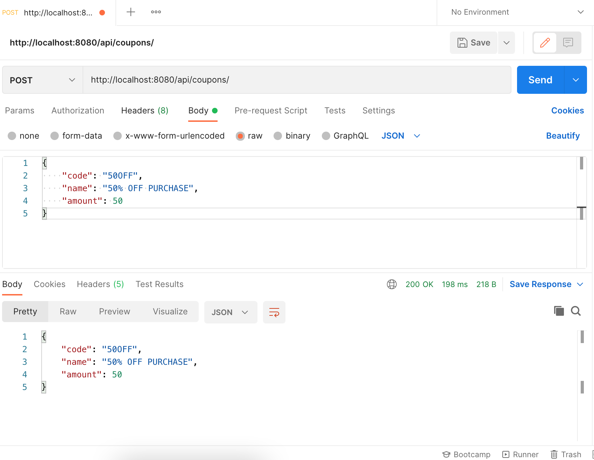
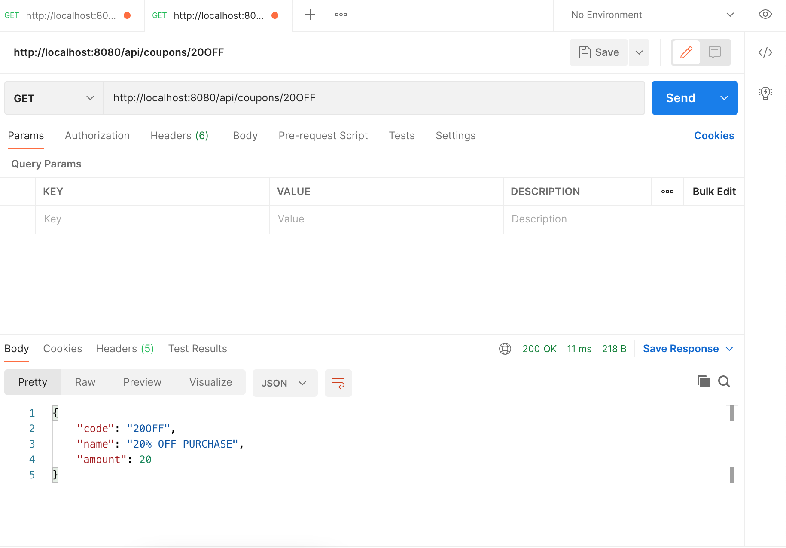

## REST API Demo

A demo of a REST API using SpringBoot, Spring Data JPA, 
and H2 database.

API EndPoints: 

@GetMapping(path="/coupons")

)

@PostMapping(path="/coupons")

@GetMapping(path="/coupons/{code})

